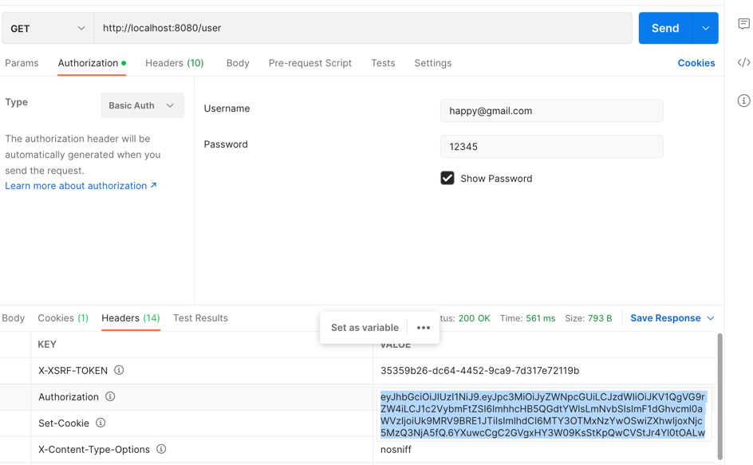
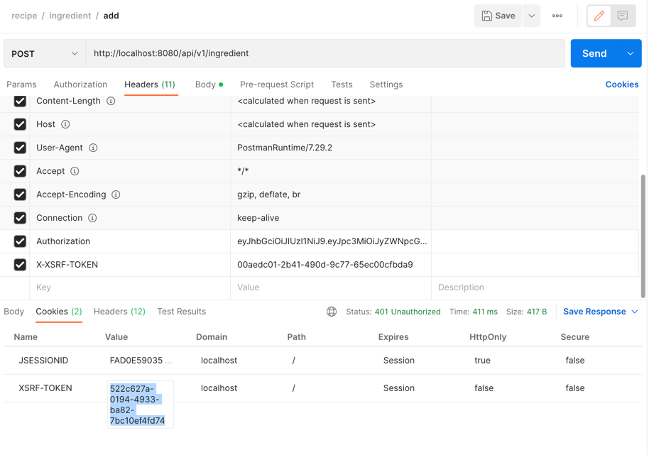
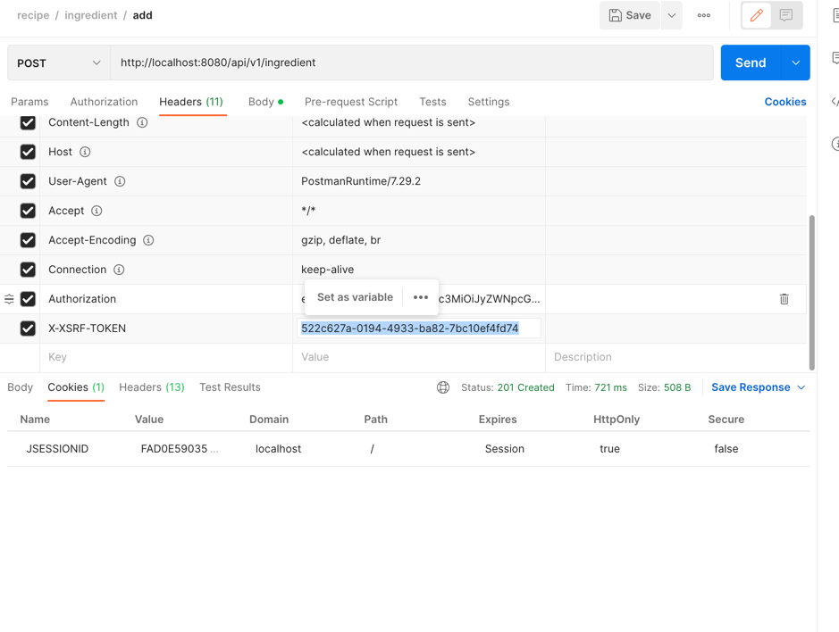
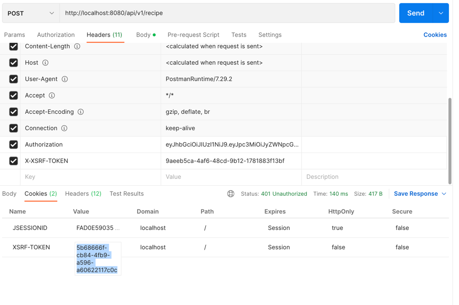

## Recipe Web Service

Recipe Web Service is specifically designed to manage recipes. It allows adding, updating, removing and fetching recipes and ingredients from database and render the requested details as JSON response to end user. It also has the search capability with helps to search recipes based on recipe ids and type of recipes and serving of the recipe.The response from ReST APIs can be further integrated with front end view for better presentation.

## System Design

Recipe Web Service is microservice based layered architecture with RESTful Web Service. There are 5 layers from top to bottom:

- Security Layer\
Top most layer which is responsible to authenticate and authorize user to access the end point.


- API Layer\
This is main interface available for front-end or end user to consume APIs
Contains end points implementation
Springboot-starter-web module used as a framework to implement ReSTful api end points

- Service Layer\
The service layer is a layer in an application that facilitates communication between the api end point and the data access layer. Additionally, business logic is stored in the service layer.
It is responsible for interacting with Data Access Layer and transferring the recipes data as required by top and below layers
Further it is a module added to decouple business logic of recipes data transfer and mapping from/to API layer.

- Data Access Layer\
The persistence layer contains all the database storage logic. It is responsible for converting business objects to the database row and vice-versa with Object Relationship Mapping (ORM).
This layer contains recipe entity classes and JPA repositories which implement lower level functionality of storing/retrieving recipes data

- Persistence Layer\
Bottom most layer, responsible for physically storing the recipes data onto database table.
Table - recipes,ingredients,recipe_ingredient are used to store the recipes data for the service
For development and testing purposes, the Embedded H2 Database provided by Spring Boot framework is also utilized


----------------------------------------- 

## Supported Features
Feature	Software Module Used

|       Feature        |          Software Module Used          |
|:--------------------:|:--------------------------------------:|
| Object Relationship  |        Mapping	Spring Data JPA       |
|  Exception Handling  | Controller Advice and ExceptionHandler |
|      Unit Tests      |           Junit 5                      |
 |  Security           |            JWT                         |


#### Minimum Requirements

- Java 17
- Maven 3.x
- Git
- Postman

### Steps to build Web Service

1. Download zip from https://github.com/jkolay/recipe_service
2. Move to recipe and follow Install application command line in recipe_service folder
3. Build project

  ```
  $ mvn clean package 
  ```
  To build by skipping unit tests run maven command 
 ```
  $ mvn clean package -DskipTests= true
  ```


On successfully build completion, one should have web service jar in target directory named as
```
recipe-0.0.1-SNAPSHOT.jar
```

Command to execute:

  ```
  $ java -jar -Dspring.profiles.active=dev recipe-0.0.1-SNAPSHOT.jar
  ```


### Swagger URL

```text
http://localhost:8080/swagger-ui/index.html#/
```

### Database components

Open browser and navigate to http://localhost:8080/h2-console/. Replace the below field details

|   Field   |       Value        |
|:---------:|:------------------:|
| JDBC URL  | jdbc:h2:mem:recipe |
| User Name |         sa         |
| Password  |      password      |
-----------------------------------

## Web Service ReST End Points Usage and Sample Response
 This application consists of 2 ROLES for the user
1. **ADMIN** - Users with admin role will be able to access all apis from recipe and ingredient apis
2. **CUSTOMER** - Users with customer role will be having access to search recipe in the portal

Recipe Api will have 2 users created in the database after starting the application
|  user_name        |  password       |  role     |
|:-----------------:|:---------------:|:----------|
| happy@gmail.com   | 12345           | ADMIN     |
| jayati@gmail.com  |  12345          | CUSTOMER  |
--------------------------------------------------
### Log In API
This api will help the user to be authenticated and authorized. This will create a token which will 
help to access the ingredient and recipe apis


##### GET (http://localhost:8080/user) 
Follow the below attachment and copy the Authorization token from the response header.




### Ingredient API
For each POST/PUT/DELETE/GET  call below set up needs to be added.
In request header two fields are required
1. Authorization 
2. X-XSRF-TOKEN (For Get request this token will not be required)

The token retrieved from log in api needs to be provided in Authorization.
The X-XSRF-TOKEN value will be unique for each session. It will be retrieved from response header of each call.
For every PUT/POST/DELETE call from postman, the first call be declared as unauthenticated and a XSRF-TOKEN value will 
be provided in the cookies. 



The highlighted value needs to be copied. And then paste the value in X-XSRF-TOKEN value. The request will pass 
and give the expected result.



Ingredient Api will be accessed only by the user having ADMIN role.

#### 1. Create Ingredient
This below end point will create a new ingredient in database

##### POST (http://localhost:8080/api/v1/ingredient)

JSON Schema
  ```
  {
  "name": "potato"
  }
 ```

 Response
 ```
  {
  "id": 1,
  "ingredient": "potato"
  }
  ```


#### 2. Get an Ingredient
This below end point will fetch ingredient from db based on provided id

##### GET (http://localhost:8080/api/v1/ingredient/{ingredient-id})
Response
 ```
  {
  "id": 1,
  "ingredient": "potato"
  }
  ```
#### 3.Get a list of Ingredient
This below end point will fetch ingredients from db based page number and numbers of records needed to fetched by each page\
 
##### GET (http://localhost:8080/api/v1/ingredient/page/{page-number}/size/{size})
Response
 ```
  [{
  "id": 1,
  "ingredient": "potato"
  }]
  ```
#### 4. Delete  an Ingredient
This end point will delete ingredient from database based on ingredient id

##### DELETE (http://localhost:8080/api/v1/ingredient?id={ingerdient-id})
Response
 ```
  200 OK
  ```
### Recipe API

#### 1. Create Recipe
For each POST/PUT/DELETE/GET  call below set up needs to be added.
In request header two fields are required
1. Authorization
2. X-XSRF-TOKEN

The token retrieved from log in api needs to be provided in Authorization.
The X-XSRF-TOKEN value will be unique for each session. It will be retrieved from response header of each call.
For every PUT/POST/DELETE call from postman, the first call be declared as unauthenticated and a XSRF-TOKEN value will
be provided in the cookies.


The highlighted value needs to be copied. And then paste the value in X-XSRF-TOKEN value. The request will pass
and give the expected result.


Recipe Api will be accessed  the users having ADMIN and CUSTOMER role.
##### POST (http://localhost:8080/api/v1/recipe)
JSON Schema
  ```
  {
    "name": "Potato curry",
    "type": "Other",
    "numberOfServings": 5,
    "ingredientIds": [1],
    "instructions": "fry potato,onion,tomato and boil with water "
}
 ```
Response
 ```
  {
    "id": 1,
    "name": "Potato Mash",
    "recipeIngredients": [
        {
            "id": 1,
            "ingredient": "potato"
        }
    ],
    "instructions": "fry potato,onion,tomato and boil with water ",
    "type": "Other",
    "numberOfServings": 5,
    "createdAt": "2023-03-20T13:02:19.515707",
    "updatedAt": "2023-03-20T13:02:19.516386"
}
  ```


#### 2. Update Recipe
This below api will create a new recipe in database
##### PUT (http://localhost:8080/api/v1/recipe)
JSON Schema
  ```
  {
    "id":1,
    "name": "Potato curry",
    "type": "Other",
    "numberOfServings": 3,
    "ingredientIds": [1],
    "instructions": "fry potato,onion,tomato and boil with water "
}
 ```
Response
 ```
  200 OK
  ```
#### 3. Get a recipe
This below end point will fetch recipe from db based on provided id
##### GET (ttp://localhost:8080/api/v1/recipe/search/{recipe-id})
Response
 ```
  {
    "id": 1,
    "name": "Potato Mash",
    "recipeIngredients": [
        {
            "id": 1,
            "ingredient": "potato"
        }
    ],
    "instructions": "fry potato,onion,tomato and boil with water ",
    "type": "Other",
    "numberOfServings": 5,
    "createdAt": "2023-03-20T13:02:19.528728",
    "updatedAt": "2023-03-20T13:02:19.528766"
}
  ```
#### 4. Get a list of recipe
This below end point will fetch list of recipes from db based on page number and number of records need to fetched in a page
##### GET (ttp://localhost:8080/api/v1/recipe/search/page/{page-number}/size/{size})
Response
 ```
  [{
    "id": 1,
    "name": "Potato Mash",
    "recipeIngredients": [
        {
            "id": 1,
            "ingredient": "potato"
        }
    ],
    "instructions": "fry potato,onion,tomato and boil with water ",
    "type": "Other",
    "numberOfServings": 5,
    "createdAt": "2023-03-20T13:02:19.528728",
    "updatedAt": "2023-03-20T13:02:19.528766"
}]
  ```
#### 5. Search recipe/recipes
This below end point will search list of recipes from db based on serving quantity
##### POST (http://localhost:8080/api/v1/recipe/search)

JSON Schema
  ```
  {
  "isVegetarian": true,
  "servings": 5,
  "ingredientIn":"potato",
  "ingredientEx": "salmon",
  "text": "mash"

}
 ```
Response
 ```
  [{
    "id": 1,
    "name": "Potato Mash",
    "recipeIngredients": [
        {
            "id": 1,
            "ingredient": "potato"
        }
    ],
    "instructions": "fry potato,onion,tomato and boil with water ",
    "type": "Other",
    "numberOfServings": 5,
    "createdAt": "2023-03-20T13:02:19.515707",
    "updatedAt": "2023-03-20T13:02:19.516386"
 }]
  ```
#### 6. Delete a  recipe
This below end point will delete a recipe based on the id provided in url
##### ### DELETE (http://localhost:8080/api/v1/recipe?id={recipeid})
Response
 ```
  200 OK
  ```
### Future Enhancements
- Integration with UI
- Write automation test cases


